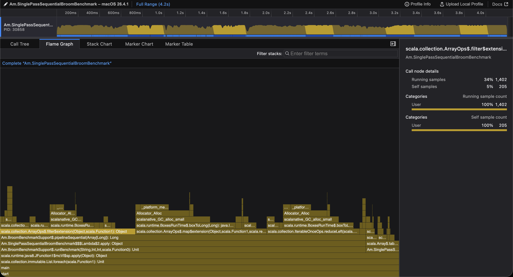
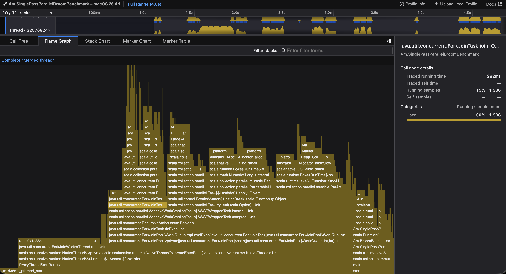

# Experimental Evaluation

## Experimental Setup

```
[info] NativeConfig(
[info]  - baseName:
[info]  - clang:                   /usr/bin/clang
[info]  - clangPP:                 /usr/bin/clang++
[info]  - linkingOptions:          [-L/usr/local/lib, -L/opt/homebrew/lib]
[info]  - compileOptions:          [-I/opt/homebrew/include, -Qunused-arguments]
[info]  - cOptions:                []
[info]  - cppOptions:              []
[info]  - targetTriple:            None
[info]  - GC:                      immix
[info]  - LTO:                     none
[info]  - mode:                    release-fast
[info]  - buildTarget              Application
[info]  - check:                   false
[info]  - checkFatalWarnings:      false
[info]  - checkFeatures            true
[info]  - dump:                    false
[info]  - sanitizer:               none
[info]  - linkStubs:               false
[info]  - optimize                 true
[info]  - incrementalCompilation:  true
[info]  - multithreading           detect
[info]  - linktimeProperties:      []
[info]  - embedResources:          false
[info]  - resourceIncludePatterns: [**]
[info]  - resourceExcludePatterns: []
[info]  - serviceProviders:        []
[info]  - optimizerConfig:
[info]     - maxInlineDepth:    32 function
[info]     - smallFunctionSize: 12 instructions
[info]     - maxCallerSize:     2048 instructions
[info]     - maxCalleeSize:     256 instructions
[info]
[info]  - semanticsConfig:         SemanticsConfig(
[info]     - finalFields: Relaxed
[info]     - strictExternCallSemantics: false
[info]     )
[info]  - sourceLevelDebuggingConfig: SourceLevelDebuggingConfig[Disabled]
[info]     - customSourceRoots:       []
[info]     - generateFunctionSourcePositions: false
[info]     - generateLocalVariables:  false
[info]     )
[info] )
```

## Regions best-case approximation

Table: Final benchmark timings for the evaluated implementations

| n    | Zone      | Regular    | SafeZone     |
|-----:|:---------:|:----------:|:------------:|
| 500  | 6.21 ms   | 72.68 ms   | 107.74 ms    |
| 1000 | 22.04 ms  | 299.92 ms  | 532.24 ms    |
| 1500 | 48.71 ms  | 620.42 ms  | 2124.58 ms   |
| 2000 | 88.78 ms  | 1428.67 ms | 5538.24 ms   |
| 2500 | 143.25 ms | 1768.85 ms | 10021.95 ms  |
| 3000 | 215.05 ms | 2341.87 ms | 20213.02 ms  |

Across the tested sizes, the off-heap `Zone` implementation was the fastest variant by a wide margin. Relative to the regular implementation, `Zone` was between 10.9× and 16.1× faster, while it was between 17.3× and 94.0× faster than `SafeZone`. The gap widened as `n` increased, suggesting the off-heap approach scales substantially better for this workload than the heap-allocated alternatives.

### Flamegraphs


An allocation-heavy benchmark that performs 100,000,000 object allocations inside a single `Zone` completed in **5020.96 ms**, showing that zone-based allocation performance degrades when memory is kept within one scoped region.


## Immix

ZONE SEQUENTIAL beats.
Others need to be re-evaluated, from manual run Parallel on 16_000_000 elements is not much worse than Seq:
```
def pipelineParallel(input: Array[Long]): Long = {
    input.par
        .map(x => x * 3 + 17)
        .filter(x => x % 7 != 0)
        .sum
  }
```
```
 % samply record ./immix/Am.SinglePassSequentialBroomBenchmark 16000000
=== Broom-Inspired Single-Pass Pipeline Benchmark ===
  warmup    : 0 runs
  measured  : 5 runs

  data size : 16000000 elements

Sequential
    runs:
       1:849.1 ms
       2:811.3 ms
       3:783.7 ms
       4:715.8 ms
       5:685.1 ms
All tasks terminated.
Local server listening at http://127.0.0.1:3004
Press Ctrl+C to stop.
```
Filter, for example, takes 34%

```
% samply record ./immix/Am.SinglePassParallelBroomBenchmark 16000000
=== Broom-Inspired Single-Pass Pipeline Benchmark ===
  warmup    : 0 runs
  measured  : 5 runs

  data size : 16000000 elements

Parallel
    runs:
       1:1454.8 ms
       2:560.3 ms
       3:393.9 ms
       4:376.6 ms
       5:1397.4 ms
Stopping profile.
Local server listening at http://127.0.0.1:3004
Press Ctrl+C to stop.
```
ForkJoinTask 15%

```
 % ./immix/Am.SinglePassZoneSequentialBroomBenchmark 16000000
=== Broom-Inspired Single-Pass Pipeline Benchmark (Zone Sequential) ===
  warmup    : 0 runs
  measured  : 5 runs

  data size : 16000000 elements

Zone Seq
    runs:
       1:52.8 ms
       2:15.5 ms
       3:15.6 ms
       4:15.5 ms
       5:15.4 ms
```
```
% ./immix/Am.SinglePassZoneParBroomBenchmark 16000000
=== Broom-Inspired Single-Pass Pipeline Benchmark ===
  warmup    : 0 runs
  measured  : 5 runs

  data size : 16000000 elements

Zone Par
    runs:
       1:1354.1 ms
       2:1064.2 ms
       3:963.6 ms
       4:999.1 ms
       5:1353.6 ms
```

The Immix executables were run without command-line parameters. The results are
tabulated below and preserve the original measurements, including truncated runs
and allocation failures.

### Aggregation

| Benchmark | 250000 | 1000000 | 2250000 | 4000000 | 6250000 | 9000000 | 12250000 | 16000000 |
|:--|:--|:--|:--|:--|:--|:--|:--|:--|
| Immix.AggregationParallelBroomBenchmark | 39.5, 30.8, 36.0, 32.4, 32.4 ms | 268.3, 165.1, 183.0, 90.7, 155.3 ms | 221.3, 405.4, 214.9, 227.6, 208.0 ms | 496.1, 675.9, 658.6, 331.2, 376.2 ms | 602.0, 601.6, 520.5, 525.1, 554.7 ms | 1264.0, 978.3, 828.3, 752.6, 827.1 ms | 2010.4, 2069.6, 1778.2, 1404.4, 1436.7 ms | 3779.3, 3437.1, 3753.6, 3799.7, 3495.4 ms |
| Immix.AggregationSequentialBroomBenchmark | 23.3, 18.4, 16.0, 19.4, 14.8 ms | 138.0, 95.6, 100.1, 97.9, 90.1 ms | 290.7, 219.1, 258.5, 211.0, 255.1 ms | 403.1, 591.8, 320.8, 416.6, 352.4 ms | 905.0, 629.6, 626.1, 802.0, 501.7 ms | 1057.0, 766.8, 769.4, 885.7, 751.5 ms | 1107.8, 1465.7, 1005.5, 1043.6, 1472.2 ms | 1591.9, 2071.7, 1737.4, 1504.5, 1447.1 ms |
| Immix.AggregationZoneParBroomBenchmark | 43.7, 26.5, 21.4, 20.5, 22.5 ms | 187.7, 116.5, 122.5, 160.1, 116.4 ms | 203.5, 185.7, 209.9, 211.7, 243.3 ms | 722.5, 541.8, 614.8, 566.9, 372.7 ms | 1210.4, 1298.2, 723.2, 903.7, 793.2 ms | 1145.6, 1478.8, 2037.5, 1354.4, 1477.7 ms | 3506.6, 2025.0, 2649.2, 2136.5, 2725.8 ms | 4526.8, 5102.9, 3226.7, 2765.0, 3962.3 ms |
| Immix.AggregationZoneSequentialBroomBenchmark | 0.4, 0.3, 0.3, 0.3, 0.4 ms | 1.6, 1.2, 1.2, 1.4, 1.2 ms | 3.8, 2.8, 2.7, 3.2, 2.7 ms | 6.7, 4.9, 5.0, 4.9, 5.0 ms | 10.8, 8.0, 7.6, 8.3, 7.5 ms | 14.5, 11.2, 10.9, 11.9, 11.4 ms | 20.6, 15.5, 17.0, 19.3, 17.4 ms | 27.3, 19.7, 19.4, 21.0, 20.8 ms |

### Multi-Epoch

| Benchmark | 250000 | 1000000 | 2250000 | 4000000 | 6250000 | 9000000 | 12250000 | 16000000 |
|:--|:--|:--|:--|:--|:--|:--|:--|:--|
| Immix.MultiEpochParallelBroomBenchmark | 460.4, 547.7, 399.8, 713.6, 676.3 ms | 2301.9, 1823.4, 1479.4, 1739.8, 1204.4 ms | 4384.5, 5613.5, 6345.8, 5222.4, 6145.1 ms | 10086.6, 12357.1, 11692.2, 12105.5, 12041.8 ms | 20401.8, 20514.8, 25495.0, 11246.5, 10809.4 ms | 20975.6, 24268.6, 24512.9, 22622.8, 25590.5 ms | 28177.8, 31939.1, 33125.8, 40862.3, 38653.5 ms | 53465.5, 51212.0, 29276.6, 29018.6, 30010.9 ms |
| Immix.MultiEpochSequentialBroomBenchmark | 148.1, 172.4, 133.3, 146.5, 166.9 ms | 689.3, 493.3, 494.7, 612.0, 511.2 ms | 1332.7, 1445.5, 1209.2, 1213.6, 1195.7 ms | 1972.0, 1886.7, 2268.7, 1897.9, 1964.5 ms | 4502.9, 4869.5, 4035.4, 5601.5, 4999.2 ms | 8140.5, 6542.6, 4233.7, 4758.7, 6168.6 ms | 10676.3, 7140.9, 9530.2, 11628.4, 12499.1 ms | 16687.3, 17542.0, 18130.7, 20308.0, 18410.0 ms |
| Immix.MultiEpochZoneParBroomBenchmark | 374.7, 253.8, 272.5, 334.3, 418.9 ms | 1104.8, 1206.7, 1153.7, 946.8, 1076.0 ms | 3019.9, 2984.0, 3187.5, 3479.0, 3728.9 ms | 11873.2, 9319.6, 6098.7, 6497.3, 5845.8 ms | — | — | — | — |
| Immix.MultiEpochZoneSequentialBroomBenchmark | 5.1, 3.3, 5.8, 4.3, 4.0 ms | 17.1, 14.0, 21.7, 17.2, 19.8 ms | 104.2, 36.0, 33.2, 34.2, 140.7 ms | 391.7, 450.4, 118.0, 177.2, 69.7 ms | 246.6, 93.2, 103.7, 104.8, 195.3 ms | 382.9, 131.6, 189.5, 153.6, 143.1 ms | 205.7, 185.5, 876.5, 598.4, 427.9 ms | 334.2, 386.0, 322.5, 366.1, 275.4 ms |

### Single-Pass

| Benchmark | 250000 | 1000000 | 2250000 | 4000000 | 6250000 | 9000000 | 12250000 | 16000000 |
|:--|:--|:--|:--|:--|:--|:--|:--|:--|
| Immix.SinglePassParallelBroomBenchmark | 18.8, 8.0, 14.2, 7.6, 11.0 ms | 51.2, 47.2, 53.2, 34.5, 57.1 ms | 102.1, 127.1, 119.8, 147.1, 104.7 ms | 149.8, 119.0, 240.6, 212.4, 127.1 ms | 326.9, 756.1, 380.2, 200.3, 433.7 ms | 733.2, 495.7, 708.6, 516.4, 807.9 ms | 1136.5, 1480.0, 1399.9, 1214.3, 897.3 ms | 1630.8, 2232.0, 2140.9, 1997.8, 2306.4 ms |
| Immix.SinglePassSequentialBroomBenchmark | 13.9, 17.7, 13.8, 14.4, 16.0 ms | 57.4, 65.9, 80.1, 55.2, 56.2 ms | 125.5, 232.8, 158.4, 123.4, 128.4 ms | 257.5, 238.3, 213.5, 236.9, 271.8 ms | 473.0, 498.3, 336.3, 388.7, 396.3 ms | 552.5, 453.5, 616.3, 657.1, 522.1 ms | 724.2, 751.6, 916.2, 824.7, 764.5 ms | 956.9, 1209.0, 1066.6, 1638.2, 1525.5 ms |
| Immix.SinglePassZoneParBroomBenchmark | 34.4, 28.9, 18.7, 48.7, 78.3 ms | 127.2, 119.7, 97.6, 88.8, 77.5 ms | 196.7, 276.7, 144.5, 137.4, 210.2 ms | 778.4, 401.8, 662.6, 292.6, 517.7 ms | 850.9, 571.2, 759.9, 825.0, 641.4 ms | 1502.8, 1928.5, 1253.2, 1710.3, 1189.8 ms | 1927.1, 2156.2, 2083.9, 2274.1, 2726.9 ms | 2612.7, 3076.0, 3354.4, 2842.0, 3363.0 ms |
| Immix.SinglePassZoneSequentialBroomBenchmark | 0.6, 0.3, 0.3, 0.3, 0.3 ms | 2.9, 1.3, 1.3, 1.5, 1.0 ms | 6.1, 3.1, 2.4, 3.5, 5.9 ms | 13.8, 5.7, 4.9, 4.4, 5.4 ms | 19.9, 6.9, 11.7, 7.1, 8.2 ms | 28.4, 11.4, 13.5, 12.8, 12.8 ms | 56.4, 15.8, 21.6, 17.8, 15.6 ms | 54.3, 24.3, 20.7, 22.6, 33.0 ms |

## None

The `none` executables were run without command-line parameters. The results are
tabulated below and preserve the original measurements, including allocation
failures and truncated runs.

### Aggregation

| Benchmark | 250000 | 1000000 | 2250000 | 4000000 | 6250000 | 9000000 | 12250000 | 16000000 |
|:--|:--|:--|:--|:--|:--|:--|:--|:--|
| None.AggregationParallelBroomBenchmark | 21.8, 16.8, 17.4, 15.7, 17.7 ms | 80.6, 81.2, 75.2, 74.6, 81.1 ms | 197.7, 184.1, 195.7, 214.7, 224.5 ms | 401.4, 482.9, 373.5, 338.7, 352.2 ms | 651.1, 774.7, 747.9, 756.0, 1012.0 ms | [01:25:39.055] [None.AggregationParallelBroomBenchmark:25286] [ScalaNative GC\|Error] Failed to allocate or grow heap space, requested size=64.00MB, available memory=0.00MB, already allocated=9702.75MB, should preallocate=false. Consider setting GC_MAXIMUM_HEAP_SIZE env variable to limit maximal heap size. | — | — |
| None.AggregationSequentialBroomBenchmark | 16.4, 15.4, 14.5, 13.0, 14.3 ms | 65.5, 63.6, 64.2, 64.2, 64.6 ms | 153.5, 153.1, 154.1, 149.0, 176.0 ms | 310.1, 312.0, 279.5, 271.4, 281.2 ms | 517.7, 532.1, 484.6, 481.7, 493.3 ms | [01:25:46.776] [None.AggregationSequentialBroomBenchmark:25563] [ScalaNative GC\|Error] Failed to allocate or grow heap space, requested size=64.00MB, available memory=0.00MB, already allocated=9011.75MB, should preallocate=false. Consider setting GC_MAXIMUM_HEAP_SIZE env variable to limit maximal heap size. | — | — |
| None.AggregationZoneParBroomBenchmark | 26.9, 19.8, 21.7, 26.3, 23.7 ms | 76.3, 69.4, 65.9, 73.9, 76.3 ms | 154.4, 145.7, 141.0, 149.6, 144.3 ms | 333.7, 344.3, 340.5, 374.0, 346.3 ms | 565.7, 648.5, 754.1, 846.3, 581.4 ms | [01:25:56.241] [None.AggregationZoneParBroomBenchmark:25755] [ScalaNative GC\|Error] Failed to allocate or grow heap space, requested size=64.00MB, available memory=0.00MB, already allocated=9217.68MB, should preallocate=false. Consider setting GC_MAXIMUM_HEAP_SIZE env variable to limit maximal heap size. | — | — |
| None.AggregationZoneSequentialBroomBenchmark | 0.7, 0.5, 0.5, 0.5, 0.5 ms | 2.5, 1.8, 1.7, 1.8, 1.7 ms | 3.9, 2.8, 2.9, 2.9, 2.8 ms | 6.5, 4.8, 5.0, 4.9, 5.0 ms | 12.7, 9.0, 7.8, 8.1, 7.7 ms | [01:26:00.261] [None.AggregationZoneSequentialBroomBenchmark:26078] [ScalaNative GC\|Error] Failed to allocate or grow heap space, requested size=64.00MB, available memory=0.00MB, already allocated=734.56MB, should preallocate=false. Consider setting GC_MAXIMUM_HEAP_SIZE env variable to limit maximal heap size. | — | — |

### Multi-Epoch

| Benchmark | 250000 | 1000000 | 2250000 | 4000000 | 6250000 | 9000000 | 12250000 | 16000000 |
|:--|:--|:--|:--|:--|:--|:--|:--|:--|
| None.MultiEpochParallelBroomBenchmark | 96.0, 94.5, 95.2, 93.2, 92.7 ms | 468.6, 537.1, 516.2, 564.0, 497.3 ms | 1242.6, 1174.0, 1306.6, 1178.3, 1346.0 ms | 2345.7, 2371.6, 2416.7, 2439.4, 2516.7 ms | the run stopped before printing timings for this size. | — | — | — |
| None.MultiEpochSequentialBroomBenchmark | 98.7, 91.0, 89.0, 92.1, 94.4 ms | 388.5, 377.7, 365.5, 424.4, 514.8 ms | 1085.7, 1145.4, 1164.0, 1093.5, 1083.5 ms | 2096.3, 2064.8, 2144.2, 2557.5, 2090.1 ms | the run stopped before printing timings for this size. | — | — | — |
| None.MultiEpochZoneParBroomBenchmark | 106.6, 99.8, 141.0, 145.5, 120.8 ms | 525.8, 436.4, 486.2, 642.1, 607.2 ms | 1220.8, 1407.5, 1246.0, 1413.9, 1693.5 ms | the run stopped before printing timings for this size. | — | — | — | — |
| None.MultiEpochZoneSequentialBroomBenchmark | 5.5, 4.6, 4.1, 3.9, 3.9 ms | 12.8, 11.6, 11.1, 11.1, 11.1 ms | 27.6, 25.4, 25.3, 25.2, 27.9 ms | 58.8, 47.9, 51.2, 48.2, 49.6 ms | 79.7, 78.6, 71.0, 71.6, 73.0 ms | [01:27:45.722] [None.MultiEpochZoneSequentialBroomBenchmark:28367] [ScalaNative GC\|Error] Failed to allocate or grow heap space, requested size=64.00MB, available memory=0.00MB, already allocated=734.62MB, should preallocate=false. Consider setting GC_MAXIMUM_HEAP_SIZE env variable to limit maximal heap size. | — | — |

### Single-Pass

| Benchmark | 250000 | 1000000 | 2250000 | 4000000 | 6250000 | 9000000 | 12250000 | 16000000 |
|:--|:--|:--|:--|:--|:--|:--|:--|:--|
| None.SinglePassParallelBroomBenchmark | 5.4, 4.8, 4.7, 8.3, 6.2 ms | 16.6, 16.1, 15.5, 17.5, 15.2 ms | 36.7, 35.9, 34.8, 35.9, 32.2 ms | 54.1, 52.4, 54.5, 52.9, 52.2 ms | 138.1, 142.5, 184.9, 163.7, 169.7 ms | [01:27:49.546] [None.SinglePassParallelBroomBenchmark:28513] [ScalaNative GC\|Error] Failed to allocate or grow heap space, requested size=64.00MB, available memory=0.00MB, already allocated=7467.61MB, should preallocate=false. Consider setting GC_MAXIMUM_HEAP_SIZE env variable to limit maximal heap size. | — | — |
| None.SinglePassSequentialBroomBenchmark | 9.6, 9.2, 9.1, 9.1, 9.1 ms | 37.9, 37.2, 37.1, 37.0, 37.1 ms | 84.3, 83.5, 83.2, 90.3, 94.7 ms | 158.7, 148.7, 150.2, 146.9, 147.5 ms | [01:27:53.679] [None.SinglePassSequentialBroomBenchmark:28660] [ScalaNative GC\|Error] Failed to allocate or grow heap space, requested size=64.00MB, available memory=0.00MB, already allocated=6401.85MB, should preallocate=false. Consider setting GC_MAXIMUM_HEAP_SIZE env variable to limit maximal heap size. | — | — | — |
| None.SinglePassZoneParBroomBenchmark | 10.8, 9.0, 7.5, 6.1, 6.2 ms | 23.7, 24.1, 25.3, 25.4, 23.2 ms | 50.0, 50.9, 50.2, 49.3, 47.6 ms | 90.3, 90.9, 111.5, 99.3, 214.3 ms | 263.5, 256.2, 252.0, 269.0, 278.5 ms | [01:27:58.697] [None.SinglePassZoneParBroomBenchmark:28783] [ScalaNative GC\|Error] Failed to allocate or grow heap space, requested size=64.00MB, available memory=0.00MB, already allocated=8440.96MB, should preallocate=false. Consider setting GC_MAXIMUM_HEAP_SIZE env variable to limit maximal heap size. | — | — |
| None.SinglePassZoneSequentialBroomBenchmark | 0.4, 0.3, 0.3, 0.3, 0.3 ms | 1.5, 1.5, 1.0, 1.0, 1.0 ms | 5.7, 2.6, 2.3, 2.3, 2.3 ms | 5.7, 4.4, 4.2, 4.3, 4.1 ms | 9.2, 6.3, 6.9, 6.3, 6.4 ms | [01:28:01.407] [None.SinglePassZoneSequentialBroomBenchmark:28934] [ScalaNative GC\|Error] Failed to allocate or grow heap space, requested size=64.00MB, available memory=0.00MB, already allocated=734.56MB, should preallocate=false. Consider setting GC_MAXIMUM_HEAP_SIZE env variable to limit maximal heap size. | — | — |

## Discussion

The measurements answer the research question in the affirmative for this
benchmark family: off-heap allocation in Scala Native can deliver materially
better throughput than heap-based approaches for data-intensive workloads.

Taken together, the benchmarks support two practical conclusions. First,
off-heap memory is a viable strategy when predictable latency and high
throughput are the primary goals. Second, the implementation should avoid
patterns that introduce avoidable allocation overhead, since those costs can
erase most of the benefit of using zones in the first place.
